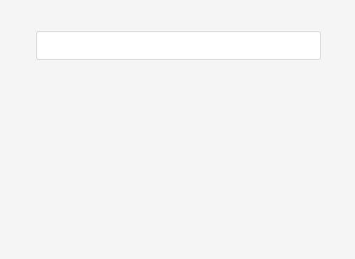

# vue-tags-component

[](https://npmjs.com/package/vue-tags-component)
[](LICENSE.md)
[](https://www.npmjs.com/package/vue-tags-component)

The package contains a Vue.js component for adding and removing tags.



## Features

- keyboard control
- search
- events
- tabindex
- colored tags
- tags creation

## Installation

You can install the package via npm:

```sh
$ npm install --save vue-tags-component
```
or yarn:

```sh
$ yarn add vue-tags-component
```

## Usage

The most common use case is to register the component globally:

```js
import Vue from 'vue';
import { VueTags } from 'vue-tags-component';

Vue.component('vue-tags', VueTags);
```

On your page you can now use html like this:

```html
<vue-tags
    :active="activeTags"
    :all="allTags"
    :element-count-for-start-arrow-scrolling="3"
    :tab-index="1"
    :tag-creation-enabled="true"
    :colors-enabled="false"
    :colors="colors"
    :tag-color-default="'green'"
    :tag-list-label="'Select an option'"
    :placeholder="'Select an option'"
    @on-tag-added="onTagAdded"
    @on-tag-removed="onTagRemoved"
    @on-tag-list-opened="onTagListOpened"
    @on-tag-list-closed="onTagListClosed"
    @on-tag-created="onTagCreated"
/>
```

All props and events are indicated in the example above. Tags should look like this:

```json
[
    {
        "id": 1,
        "name": "Tag",
        "slug": "tag (optional)",
        "color": "#963dff (optional)"
    }
]
```

## TODO

- ~~Closing the drop-down list when clicking outside the component.~~
- ~~Make the functionality of creating a new tag, add a tag creation event. Make this functionality optional (the ability to enable via props).~~
- To think up a convenient way of styling (redefining standard styles or some other way).
- Adaptive layout.
- Animation.
- ~~Placeholder for the search string (do you need?). Show the placeholder only when no tag is selected.~~
- ~~tagColorDefault prop validation.~~

## Events

### onTagAdded

Called when the tag is added to the active list, it passes the tag object.

### onTagRemoved

Called when the tag is removed from the active list, it passes the tag object.

### onTagListOpened

Called when opening a list of tags.

### onTagListClosed

Called when the list of tags is closed.

### onTagCreated

Called when a new tag is created, it passes the tag object with id = 0 (the identifier must be changed, since 0 denotes the tag to create). The component does not process the slug field of the tag, slug will be equal to the name of the tag, you can process it as you need (for example, `tag.slug.toLowerCase (). Replace (/ / g, '_')`).